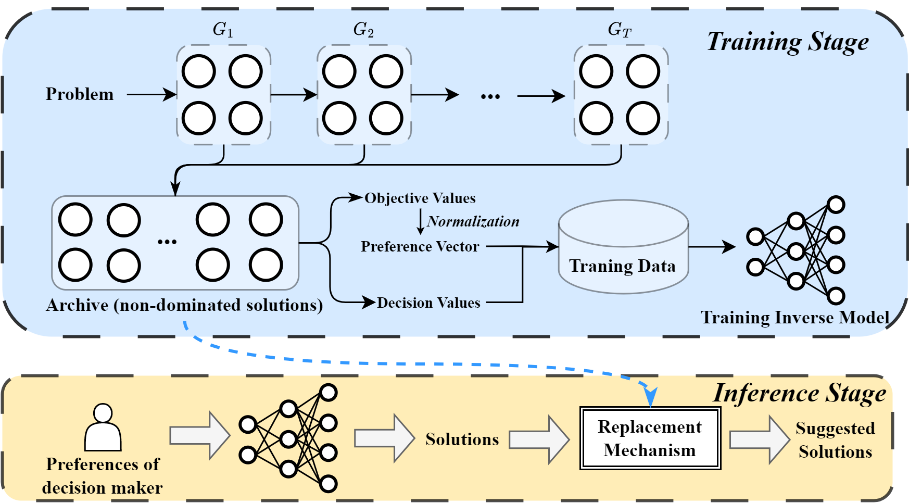

# An Unbounded Archive-Based Inverse Model in Evolutionary Multi-objective Optimization

The overview of the UAIM.

This paper has been accepted by 18th International Conference on Parallel Problem Solving from Nature (PPSN 2024). And This project is a pytorch implementation of An Unbounded Archive-Based Inverse Model in Evolutionary Multi-objective Optimization.

